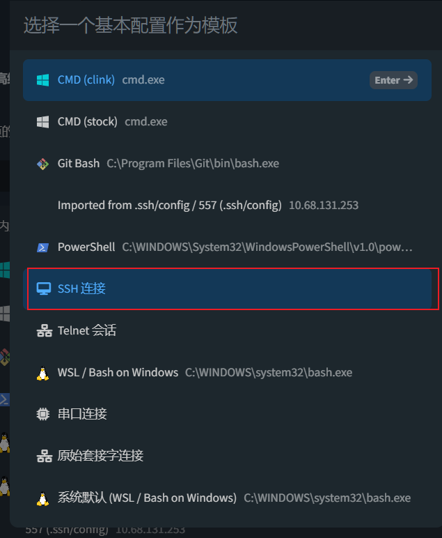

# 连接

打开windows平台中的cmd(命令提示符) 同时键入下面命令 并回车

> ping [10.68.131.253](mailto:yao@10.68.131.253)

必须接入了校园网,包括有线和无线,在路由器局域网内不能连通

<figure><figcaption></figcaption></figure>

出现上图中的样子就是可以连通服务器

在连通后输入下面命令 与服务器建立SSH连接

> ssh -p 22 [yao@10.68.131.253](mailto:yao@10.68.131.253)

<figure><figcaption></figcaption></figure>

在后面输入密码Yao557...

密码成功后与服务器连通

<figure><figcaption></figcaption></figure>

灰色框中的(base)是conda环境中的基本环境base环境, 所有python的代码都需要在一个虚拟环境中运行, 但是每个项目的环境依赖不同的话会造成冲突,所以使用conda进行环境管理, 也就是每个项目需要自己创建一个环境来运行代码

白色框中的 /mnt/sda1 是当前处在的目录, 这是一个挂载了4T的机械硬盘, 可以在将代码和数据集放置在这里,

红色框中的$是只当前是非root用户进行操作 有很多的读写操作会收到限制,不过只是运行代码不会有很多问题

连接通服务器后在cmd中很难进行操作,一般使用第三方软件操作,有Xshell,Xftp vscode,tabby

这里推荐使用tabby

所有软件都可以通过服务器下载

> scp [yao@10.68.131.253](mailto:yao@10.68.131.253):/mnt/sda1/software/tabby-1.0.189-setup-x64.exe /D:

重新打开一个命令提示符软件, 在cmd中输入上面的命令可以将tabby的安装包下载至本地目录的D盘符下 在/D:/path使用path可以自定义D盘下的指定目录

> 🚾服务器中的常用软件安装包

| Xshell-7.0.0113p.exe           | python-3.9.8.exe                    | EasyConnectInstaller.exe |
| ------------------------------ | ----------------------------------- | ------------------------ |
| Xftp-7.0.0119.exe              | python-3.8.9.exe                    |                          |
| VSCodeUserSetup-x64-1.57.0.exe | python-3.10.8-amd64.exe             |                          |
| tabby-1.0.189-setup-x64.exe    | Everything-1.4.1.1009.x64-Setup.exe |                          |

以tabby使用为例

<figure><figcaption></figcaption></figure>

点击设置后进入设置界面

<figure><figcaption></figcaption></figure>

在新设置中选择ssh连接

<figure><figcaption></figcaption></figure>

如下进行设置 名称自便, 主机是10.68.131.253 用户名是yao 身份验证方法选择密码

<figure><figcaption></figcaption></figure>

点击设置密码 Yao557... 回车后点击下方保存

<figure><figcaption></figcaption></figure>

看到刚才设置好的557 点击三角进行连接

<figure><figcaption></figcaption></figure>

选择接受并记住密钥

<figure><figcaption></figcaption></figure>

如下和在cmd中出现了一致的界面

<figure><figcaption></figcaption></figure>

### ftp

在tabby中也可以进行文件的传输 选择右上角的sftp

<figure><figcaption></figcaption></figure>

这里会直接进入到服务器的根目录这里是无法进行文件交换的 点击mnt

<figure><figcaption></figcaption></figure>

看到挂载的硬盘sda1 点击进入

<figure><figcaption></figcaption></figure>

绿色是数据集的目录 将数据集放置在该目录下

红色为个人文件夹 存放自己的文件和代码 software是刚才下载tabby等软件的目录

<figure><figcaption></figcaption></figure>

在tabby中上传文件夹比较麻烦 首先进入到software中

<figure><figcaption></figcaption></figure>

点击Xftp 会弹出下载至本地目录

<figure><figcaption></figcaption></figure>

等待上方的文件传输结束 速度过几秒后会很快

完成后打开本地文件进行安装

打开Xftp后 在弹出的对话框中 点击New

<figure><figcaption></figcaption></figure>

如下图进行设置

<figure><figcaption></figcaption></figure>

点击connect

<figure><figcaption></figcaption></figure>

红色框中的绿点为连接状态 蓝色框中为当前目录 在蓝色框中进行编辑 填入 /mnt/sda1 回车

<figure><figcaption></figcaption></figure>

进入到了前面的目录中 在这里右边是服务器的目录 左边是本地目录 可以直接通过鼠标拖拽将本地文件或文件夹发送至服务器

下方为当前传输速度和进度 可以右键下方的条目进行暂停 取消

同时在不需要root权限的目录中可以通过右键删除或者编辑服务器的文件

<figure><figcaption></figcaption></figure>
