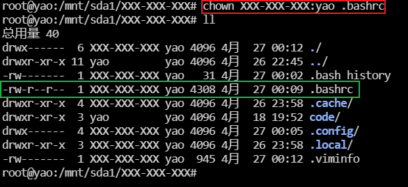

# 创建自己的账户和密码

> ‼️(此为高级操作) 如无必要 则无需进行

此操作可以为用户创建一个属于自己的ssh连接账户,用户保护自己隐私,可以达到的目的是禁止其他用户进入或执行或修改自己文件夹下的所有文件

1. 使用yao用户进行登陆 键入命令

> lastlog

<figure><figcaption></figcaption></figure>

拉到最后可以看到一般账户yao以及我们需要自己创建的私人账户,这里是管理员自己创建的账户root-wang

<figure><figcaption></figcaption></figure>

使用下面的命令创建一个名为XXX-XXX-XXX 所属组为yao 登陆时进入的文件夹(用户根目录)为/mnt/sda1/XXX-XXX-XXX下 的账户 -m的意思是如果不存在该目录则会创建该目录

这里只需要修改XXX-XXX-XXX为自己的账户名

> 🚾sudo useradd -s /bin/bash -d /mnt/sda1/XXX-XXX-XXX -g yao -m XXX-XXX-XXX

输入密码Yao557... 进行用户创建

<figure><figcaption></figcaption></figure>

此时提示用户文件夹已经存在 则不需要重新创建

<figure><figcaption></figcaption></figure>

再次输入 此时在最后可以看到新的用户

> lastlog

<figure><figcaption></figcaption></figure>

但是还没有为该账户设置密码是无法使用的 输入命令设置新的密码

> sudo passwd XXX-XXX-XXX

<figure><figcaption></figcaption></figure>

这里密码设置为123456

<figure><figcaption></figcaption></figure>

进入终端应用主机设置不变 用户名为设置的用户名 XXX-XXX-XXX 密码为123456

<figure><figcaption></figcaption></figure>

点击连接进入到该用户的命令终端中去

此时可以看到用户为XXX-XXX-XXX 而用户组还是yao

<figure><figcaption></figcaption></figure>

输入ls则可以看到该用户目录下的所有文件

使用cd .. 可以退出到上一级目录 还记得我们设置用户登陆的目录是/mnt/sda1/XXX-XXX-XXX

则退到父目录为/mnt/sda1 如下则是

<figure><figcaption></figcaption></figure>

此时在XXX-XXX-XXX的父级目录键入

> ls -ll

<figure><figcaption></figcaption></figure>

可以看到所有文件夹的权限 首先看黄色的内容 d是文件类型无需理会

linux将文件夹权限分为读取(r) 改写(w) 执行(x)

对于使用者也分了三类为文件所属用户(u-User) 所属组(g-Group) 除开所属用户和组之外的所有用户(o-Others)

所以文件夹XXX-XXX-XXX的权限是用户XXX-XXX-XXX拥有所有权限, 组yao的其他用户拥有读取和执行权限,组外其他用户拥有读取和执行的权限

> 😅d rwx r-x r-x

<figure><figcaption></figcaption></figure>

<figure><figcaption></figcaption></figure>

| linux表示 | 说明      | linux表示 | 说明    |
| ------- | ------- | ------- | ----- |
| r—      | 只读      | -w-     | 仅可写   |
| —x      | 只可执行    | rw-     | 可读可写  |
| -wx     | 可读可执行   | r-x     | 可读可执行 |
| rwx     | 可读可写可执行 | —-      | 无权限   |

则我们需要的是将权限改变为所属用户u拥有所有权限 而其他两个不有任何权限 则如下的权限

```bash
d rwx --- ---
```

### 以下步骤请联系管理员进行操作

则是执行如下的操作 chmod 是改变文件夹的权限 g-r 的意思是对于该文件夹组内其他用户取消读取该文件夹的权限

> chmod g-r XXX-XXX-XXX/

<figure><figcaption></figcaption></figure>

此时键入ll 则可以看到文件夹的权限变化

<figure><figcaption></figcaption></figure>

但是这只是改变了文件夹的权限 而注意该文件夹的所有者是yao 而我们要做的是将所有者改为XXX-XXX-XXX

下述命令是将文件夹XXX-XXX-XXX/的所有这改为XXX-XXX-XXX

> chonw XXX-XXX-XXX XXX-XXX-XXX/

<figure><figcaption></figcaption></figure>

再次键入ll注意到所有者变为了XXX-XXX-XXX

<figure><figcaption></figcaption></figure>

### 测试

使用用户yao进入系统 然后尝试进入文件夹XXX-XXX-XXX会提示权限不足

<figure><figcaption></figcaption></figure>

### 此时使用账户XXX-XXX-XXX登陆终端

发现无法使用conda命令而且在命令提示符前也没有登陆就有的默认conda环境

这是因为新创建的用户没有办法读取到安装conda的用户yao的环境

<figure><figcaption></figcaption></figure>

此时使用用户yao登陆

使用下面的命令将yao用户的环境配置复制到新用户的根目录下也就是 /mnt/sda1/XXX-XXX-XXX

注意将XXX-XXX-XXX 改为实际用户目录

> sudo cp \~/.bashrc /mnt/sda1/XXX-XXX-XXX/.bashrc

输入密码后此时无法进入XXX-XXX-XXX的用户目录下

<figure><figcaption></figcaption></figure>

由于文件.bashrc的所有者是root 其他用户也只是只读无法执行 所以联系管理员更改该文件的所有者为XXX-XXX-XXX

<figure><figcaption></figcaption></figure>

修改文件.bashrc所有者为 XXX-XXX-XXX 所有组为yao

> chown XXX-XXX-XXX:yao .bashrc

<figure><figcaption></figcaption></figure>

### 使用用户XXX-XXX-XXX登陆

虽然获得了配置文件但是还没有生效 此时键入ll等命令无效

<figure><figcaption></figcaption></figure>

> source .bashrc

使用上述命令立即生效 则读取到系统的conda环境并激活为base

<figure><figcaption></figcaption></figure>

但是当关闭终端再次登陆时会发生问题

新登陆的终端并没有默认激活conda环境这是因为没有设置.bash\_profile文件

<figure><figcaption></figcaption></figure>

在用户根目录下使用命令

> vim .bash\_profile

在vim中复制下面的代码

```bash
# .bash_profile
        
if [ -f ~/.bashrc ]; then
    . ~/.bashrc                                                                                                                    
fi 

```

<figure><figcaption></figcaption></figure>

最后使用 :wq 回车保存退出

关闭终端再次连接 问题解决

<figure><figcaption></figcaption></figure>

.bashrc文件是用户yao的配置所以生效后会发现登陆的初始目录发生了变化

这里来修改文件的配置 进入XXX-XXX-XXX目录中

> vim .bashrc

红色为用户yao的环境配置文件所以默认进入目录为 /mnt/sda1

<figure><figcaption></figcaption></figure>

修改其为自己的目录 然后保存退出

<figure><figcaption></figcaption></figure>

关闭后重新连接 使用命令

> pwd

查看当目录的路径 解决问题

<figure><figcaption></figcaption></figure>

🎉
