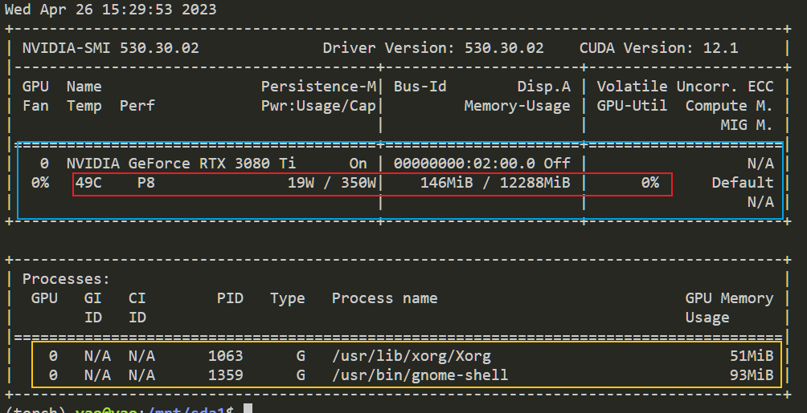

# 数据集

### 数据集的地址需要改为/mnt/sda1/dataset/xxx 对应的数据集位置

### 使用GPU前请先使用nvidia-smi命令查看GPU的使用情况

> 📌nvidia-smi

其中蓝色内为当前GPU的使用情况,红框中分别是GPU温度.GPU当前功率/额定功率 显存占用 **GPU** 实际运算能力的利用率 下方黄色为使用GPU的进程

<figure><figcaption></figcaption></figure>

之前将代码放在了目录下 现在需要激活对应的python环境来运行
