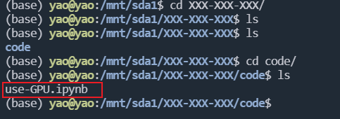
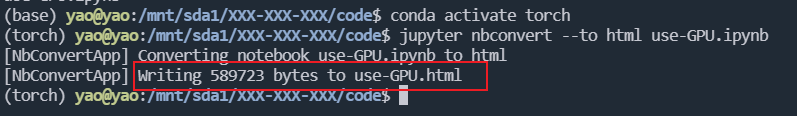
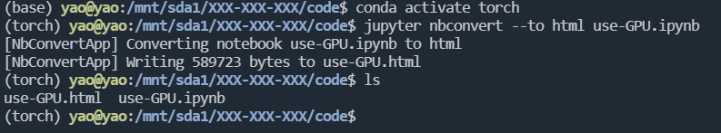
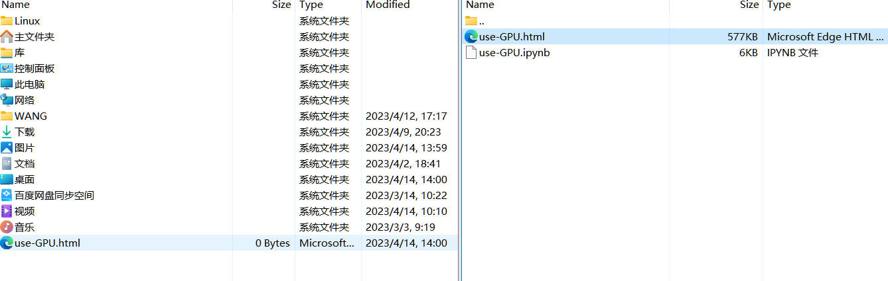
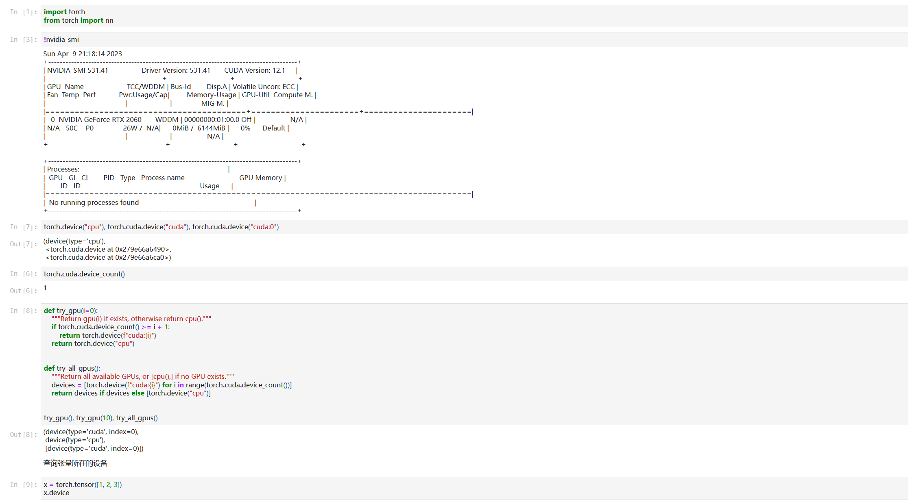
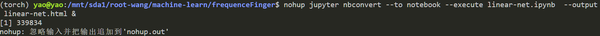
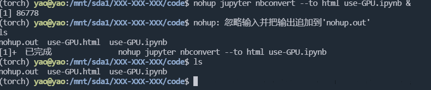
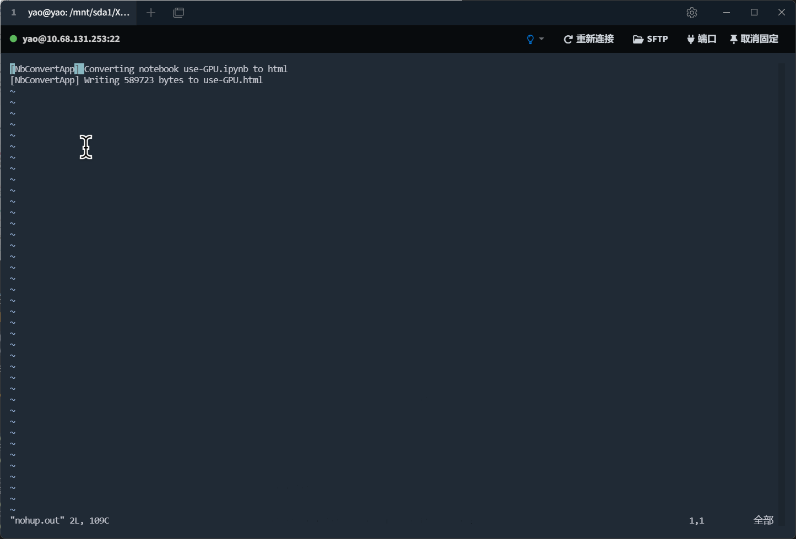
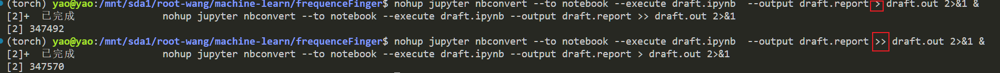
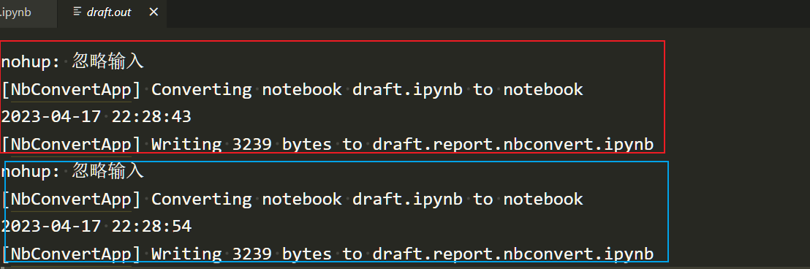

# jupyter

<figure><figcaption></figcaption></figure>

#### jupyter后台运行(需要进行长时间的运行的代码)

使用如下命令来通过运行ipynb文件 该操作会将结果写入到html中

> jupyter nbconvert --to html --execute notebook.ipynb

<figure><figcaption></figcaption></figure>

此时ls 发现多出了一个html文件

<figure><figcaption></figcaption></figure>

在xftp中进入到对应目录 将html文件取回至本地目录

<figure><figcaption></figcaption></figure>

在浏览器中打开后可以看到输出

<figure><figcaption></figcaption></figure>

该方法建议在确定没有错误时可以使用 最好在本地debug后确定可以正常运行 同时在运行时(如下图),不能退出断开与服务器连接

<figure><figcaption></figcaption></figure>

使用下面语句将会在后台挂起该程序,此时可以进行断开操作 返回该进程的PID号码 用于kill 符号&的意思是挂起该任务

> 📌nohup jupyter nbconvert --to notebook --execute use-GPU.ipynb --output use-GPU.report &

上面的任务命令如下, 意思是将use-GPU.ipynb中代码全部执行 并将结果保存在use-GPU.report.ipynb中

\--to notebook 是将输出保存为ipynb文件格式 文件名为use-GPU.report.ipynb

可以将输出保存为html格式 使用--to html 注意该选择需要安装依赖nbconvert

> jupyter nbconvert --to html --execute use-GPU.ipynb --output use-GPU.report

主要如果不存在nohup.out文件 会自动创建该文件 并将终端输出到该文件中

但是如果已经存在nohup.out文件 会将新的任务的输出覆盖 如果需要将后续任务输出添加到该文件中则需要

> nohup jupyter nbconvert --to notebook --execute use-GPU.ipynb --output use-GPU.report &

上面是将任务jupyter nbconvert --to notebook --execute use-GPU.ipynb --output use-GPU.report的输出结果将追加到nohup.out文件中

<figure><figcaption></figcaption></figure>

看到nohup.out为该程序的输出(不是代码运行结果而是终端输出)

使用vim nohup.out可以检查输出

<figure><figcaption></figcaption></figure>

看到writing XXXX bytes to xxxx.html 则说明程序结束了

按住shift和冒号 屏幕下方出现 : 此时输入 q 然后回车退出该界面(vim使用方法)

但是有时候需要将输出追加到nohup.out中也就是

> nohup jupyter nbconvert --to notebook --execute draft.ipynb --output draft.report >> draft.out 2>&1 &

注意第一条命令是新建一个文件draft.out来记录任务输出结果

而第二个是将该任务第二次执行的结果追加到之前的日志中

<figure><figcaption></figcaption></figure>

在draft.out中可以看到两个任务的情况

<figure><figcaption></figcaption></figure>

如果会有很多的任务输出结果添加在文件draft.out 中但是shell并没有提供时间戳这里可以使用函数

```python
def showProcessEndTime():
    os.system(time.strftime("echo %Y-%m-%d %H:%M:%S", time.localtime()))
```

在代码文件的末尾执行该函数则可以将任务结束时间记录在日志中

这里我们将在日志文件中添加这个任务的结束时间方便分辨任务

当然也可以将不同任务分开使用不同的文件记录输出 也方便分开查询任务是否在后台完成
