# VSCode(推荐使用)

vscode帮助集成了ssh远程连接, 文件上传下载, 代码编辑及运行, 可以十分方便的在本地使用服务器来运行调试代码

使用Xftp在服务器获取VSCode安装包进行安装 如下 点击扩展图标

<figure>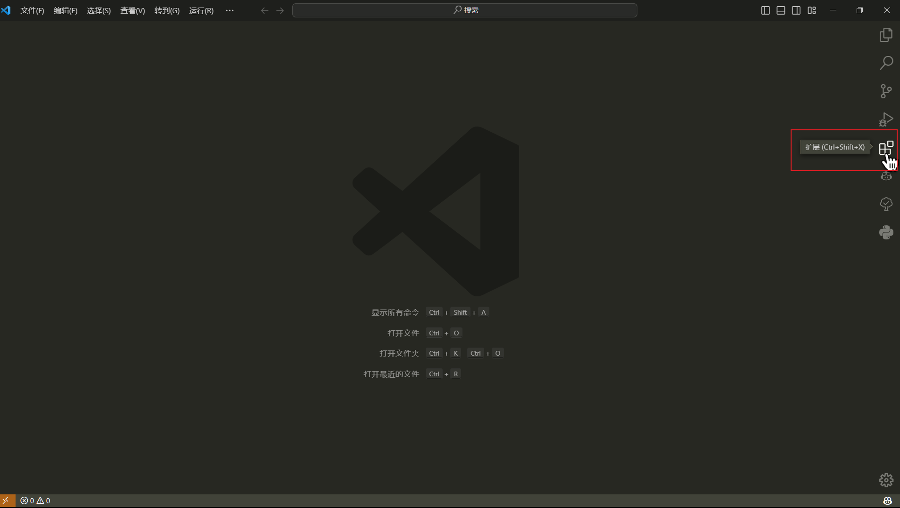<figcaption></figcaption></figure>

搜索chinese 自动出现搜索结果 点击简体中文安装 然后右下角会提示restart

<figure>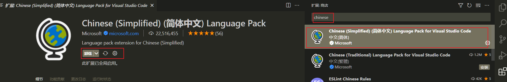<figcaption></figcaption></figure>

同理 继续搜索扩展remote 点击下图所示插件进行安装

<figure>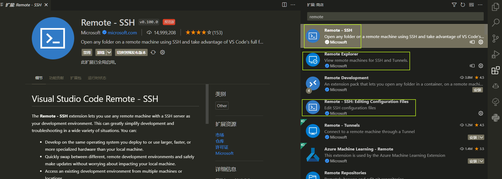<figcaption></figcaption></figure>

安装成功后重启vscode在左下角看到橙色图标点击

<figure>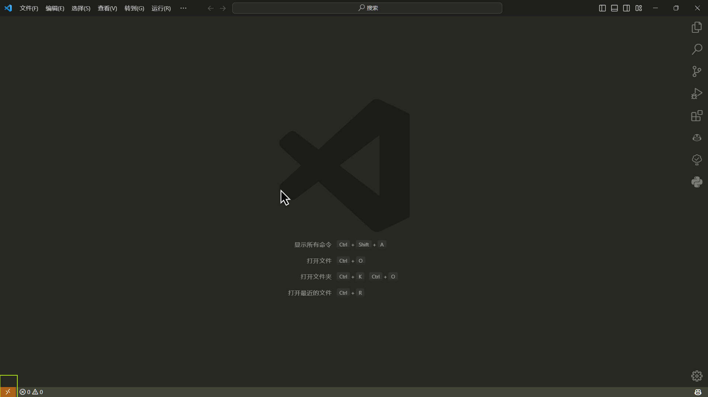<figcaption></figcaption></figure>

在上方弹出窗口后选择Connect to Host

<figure>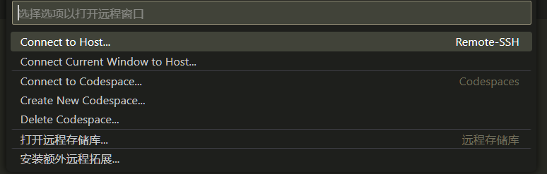<figcaption></figcaption></figure>

选择Configure SSH Hosts

<figure>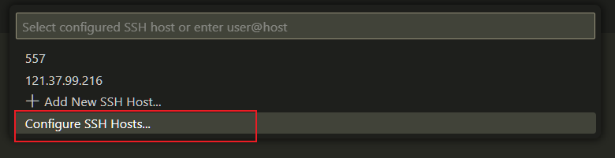<figcaption></figcaption></figure>

在弹出的列表中选择第一个(一般是)注意红色框中一般为自己计算机的用户名(因人而异)

<figure>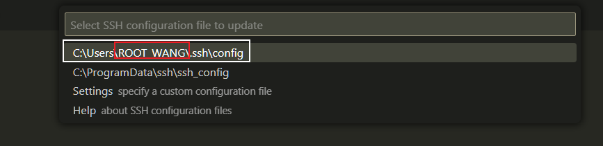<figcaption></figcaption></figure>

点击后自动打开该文件 按照红色框中的内容进行填写Host为自定义名称 使用ctrl+s 进行保存

<figure>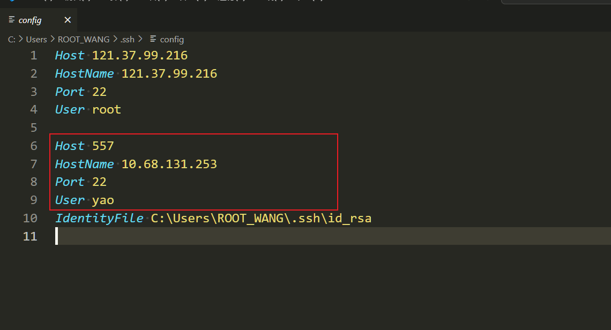<figcaption></figcaption></figure>

保存后会在侧边栏的远程资源管理器中可以看到557选项,点击在新窗口中连接

<figure>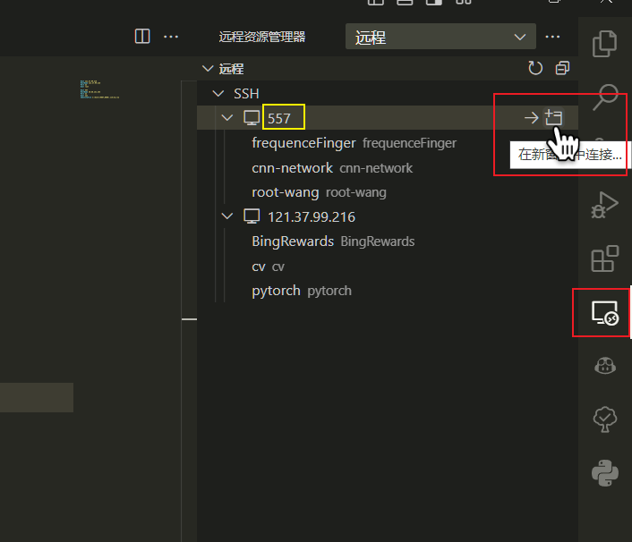<figcaption></figcaption></figure>

应当选择Linux

缺失图片

输入密码 <mark style="background-color:blue;">**Yao557...**</mark>

<figure>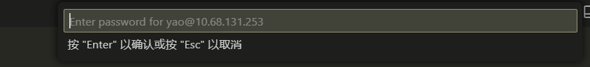<figcaption></figcaption></figure>

如下即为连接成功

<figure>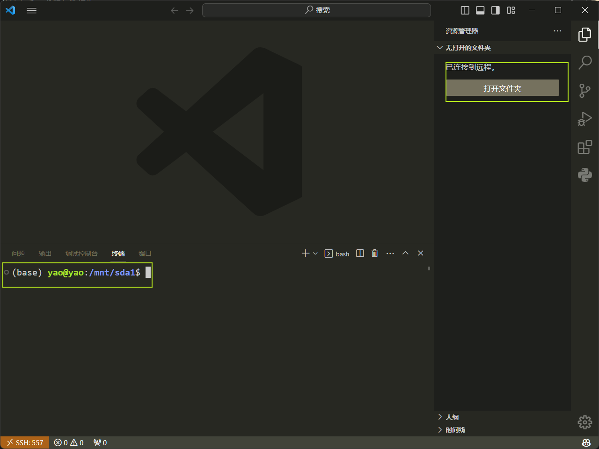<figcaption></figcaption></figure>

点击打开文件夹 将/home/yao/ 改为/mnt/sda1/

<figure>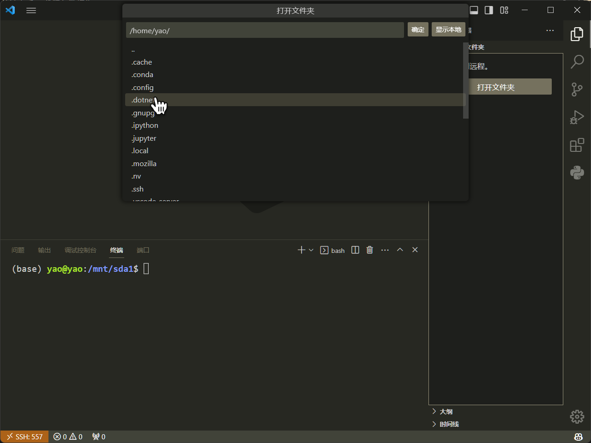<figcaption></figcaption></figure>

此时会自动显示该目录下的文件夹 选择自己的文件夹

<figure>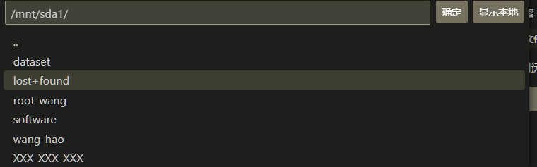<figcaption></figcaption></figure>

点击确定

<figure>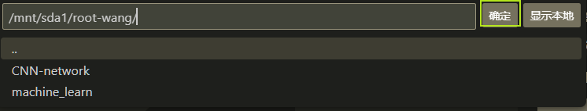<figcaption></figcaption></figure>

点击红色图标显示操作终端 绿色为该目录下的文件 再次点击红色隐藏终端

<figure>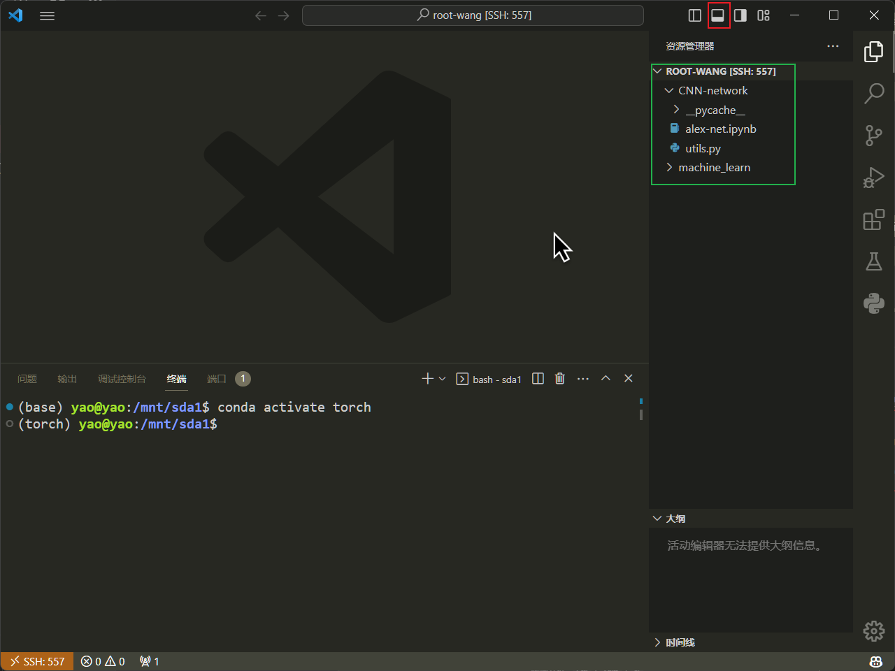<figcaption></figcaption></figure>

点击右侧ipynb文件可以直接打开

<figure>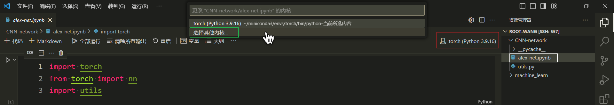<figcaption></figcaption></figure>

此时有了代码 还需要选择python环境 点击红色选择内核在弹出的窗口中选择其他内核

选择 Python环境

<figure>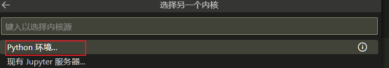<figcaption></figcaption></figure>

可以看到目前服务器miniconda中所有的的虚拟环境 选择需要的环境即可 这里和在终端使用

conda env list 结果一致

<figure>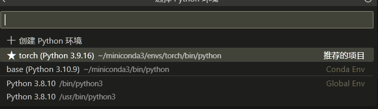<figcaption></figcaption></figure>

有了环境之后 可以直接运行代码

选择绿色执行所有代码 点击每个cell的红色执行该代码

<figure>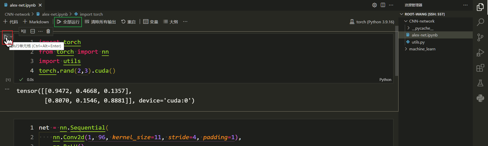<figcaption></figcaption></figure>

同理对于需要后台运行的代码可以在vscode调试好 然后在vscode提供的终端中进后台运行

> vscode中可以直接使用ctrlcv复制粘贴
