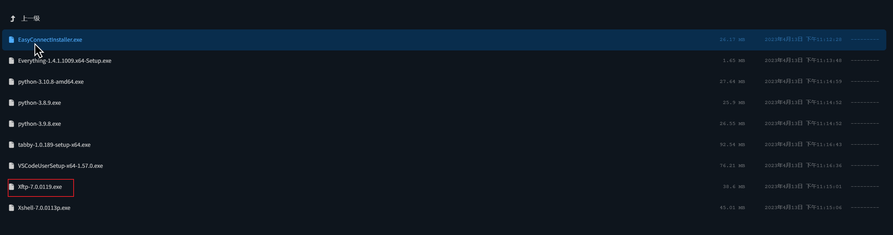
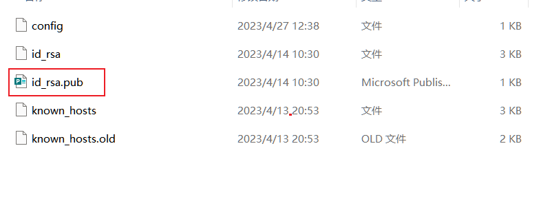

# 在vscode中默认记住密码

在自己电脑打开cmd 输入

> ssh-keygen

<figure><figcaption></figcaption></figure>

一路yes或者回车即可

进入自己的电脑目录 XXX为自己的电脑用户名

> C:\Users\XXX\\.ssh

在该目录下找打文件 id\_rsa.pub

<figure><figcaption></figcaption></figure>

复制文件并重命名为自己的服务器用户名 如 XXX-XXX-XXX.pub

打开tabby 打开sftp 一路点击进入.ssh 文件夹中 并将刚才改名的文件上传至该处

<figure><figcaption></figcaption></figure>

在终端中进入到 /home/yao/.ssh 目录中 键入 ll 看到上传的文件

<figure><figcaption></figcaption></figure>

将 XXX-XXX-XXX.pub 改为实际文件 并使用下述的命令执行

如需输入密码 则为 Yao557...

> sudo cat XXX-XXX-XXX.pub >> authorized\_keys

此时关闭vscode再次登陆的话则不需要输入密码了
