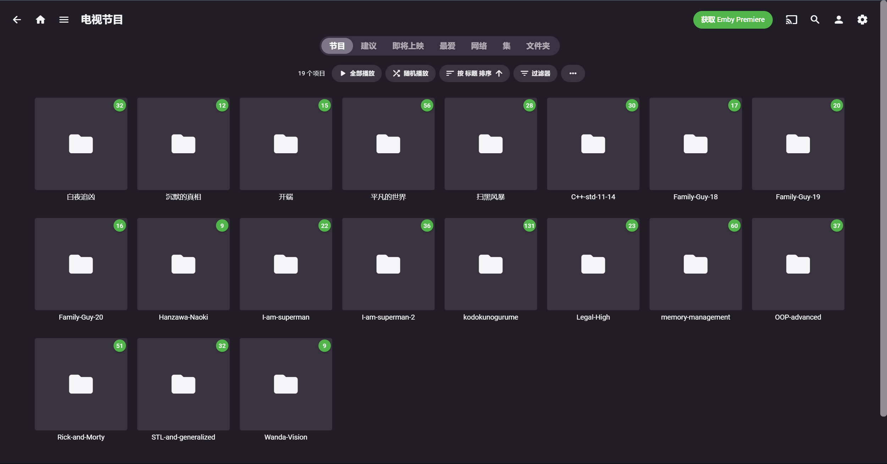
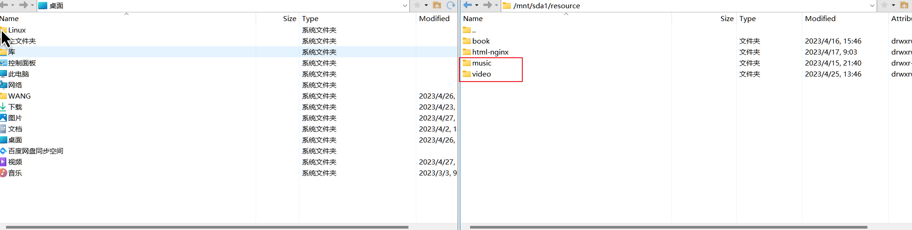
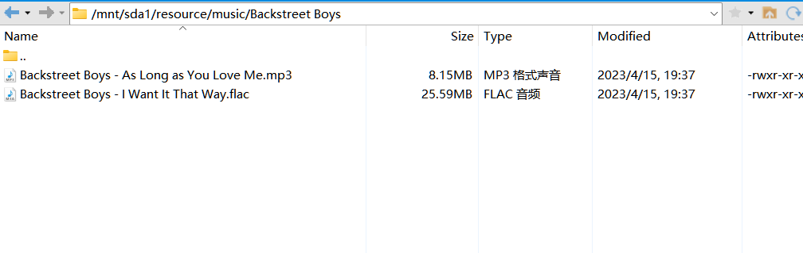
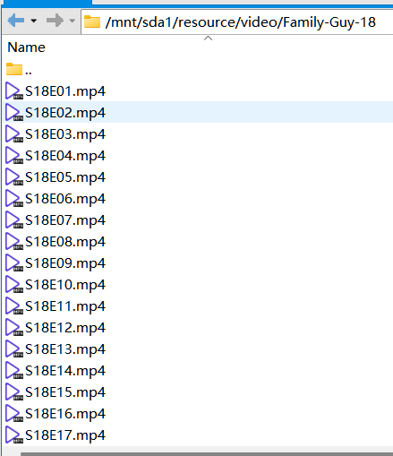
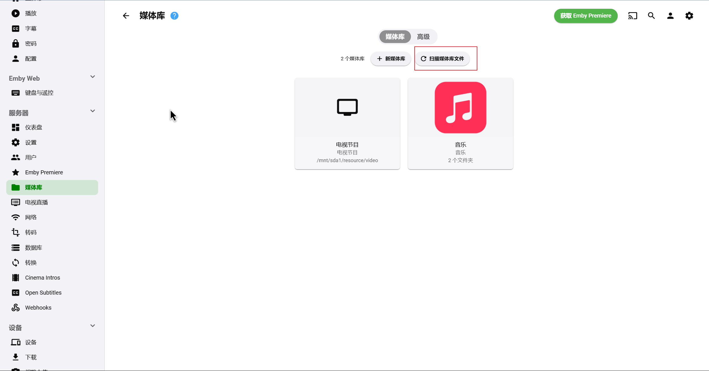

# 8096 Emby在线影音服务

### 8096 Emby在线影音服务

该端口服务提供音视频在线流媒体播放以及下载

<figure><figcaption></figcaption></figure>

在浏览器键入下方地址进入

> [http://10.68.131.253:8096/](http://10.68.131.253:8096/)

每个用户应当设定属于自己的用户名和账户, 一是方便管理, 二是使用不同的账户登陆可以进行个人个性化定制与账户的观影记录

#### 账户注册方式

自己想好账户名和密码 微管理员进行注册即可

#### 重要:自己上传音视频

打开Xftp 进入目录 /mnt/sda1/resource 下 看到音视频文件夹

<figure><figcaption></figcaption></figure>

#### 音乐

直接将本地的音乐文件上传至该文件夹下或者自行建立文件夹

> ‼️必须使用英文字符命名音乐文件

<figure><figcaption></figcaption></figure>

#### 视频

上传即可

> ‼️必须使用英文字符命名视频文件 格式为 SXEX 即第几季第几级
>
> 

音乐视频均已启用文件夹实时监控 上传完毕后服务会自动扫描更新

如未发现则在设置中自行扫描

<figure><figcaption></figcaption></figure>

### 建立新的端口服务需要在port-mapping.json中注册

### 开放端口需要联系管理员

```bash
vim /mnt/sda1/port-mapping.json
```
