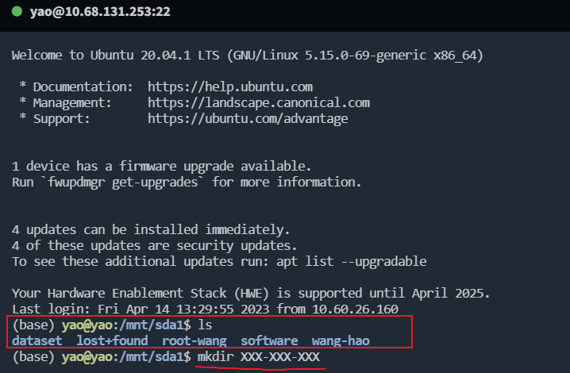
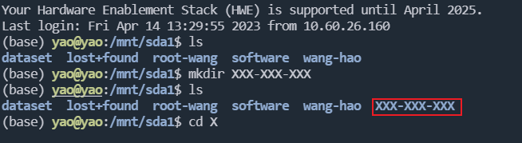
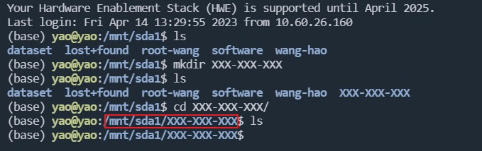
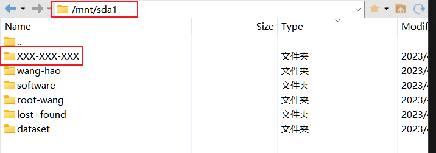
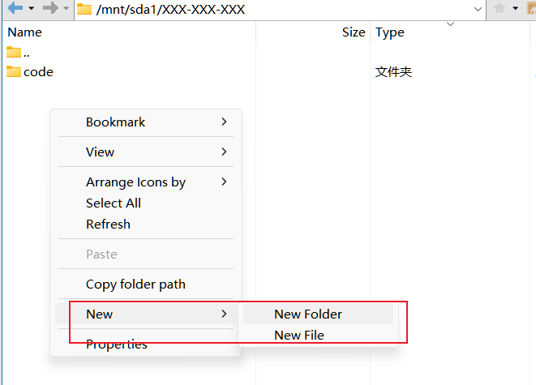
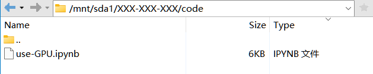
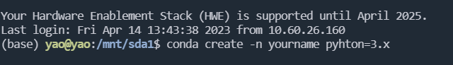
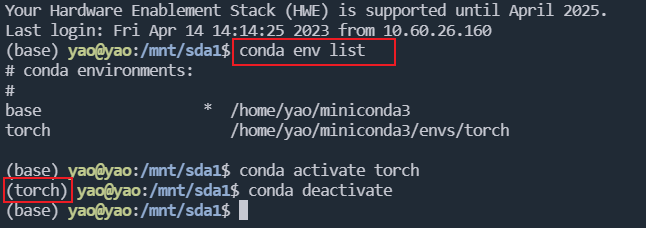
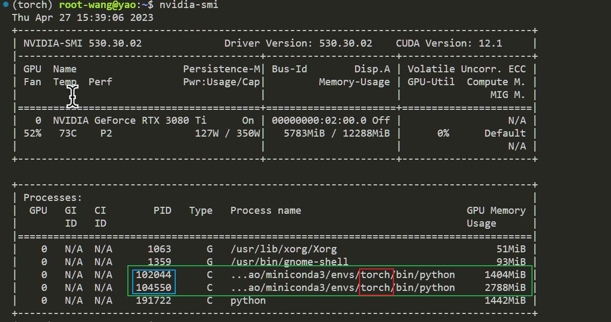

# 选择用户文件夹

登陆服务器器后 输入ls 列出当前目录下的文件和文件夹

通过 mkdir xxx-xxx-xxx 创建名称为 xxx-xxx-xxx的文件夹

<figure><figcaption></figcaption></figure>

再次使用ls可以看到新创建的文件夹

使用cd XXX-XXX-XXX可以进入到新文件夹中 (在输入X时可以使用TAB键自动补全该文件夹的名称

<figure><figcaption></figcaption></figure>

进入后 在命令提示符前当前目录也发生了变化 使用ls

由于是新创建的文件夹所以在该目录下没有任何文件

<figure><figcaption></figcaption></figure>

打开Xftp进入到 /mnt/sda1 中去可以看到新创建的文件夹 双击进入

<figure><figcaption></figcaption></figure>

在该目录下右键空白处可以创建新的文件夹 或者在左边将代码拖拽至右侧

<figure><figcaption></figcaption></figure>

如下将文件发送至该目录下 在shell中进入code目录 使用ls同样可以看到该文件

<figure><figcaption></figcaption></figure>

### 创建自己的pyhton虚拟环境

在base环境下创建自己的python虚拟环境

虚拟环境可以保证每个程序之间依赖隔离,避免造成依赖冲突 yourname 为环境名称 3.x为该环境python的版本号

注意使用 shift + ins 进行粘贴至shell中

> conda create -n yourname pyhton=3.x

<figure><figcaption></figcaption></figure>

使用conda env list 检查当前所有的虚拟环境

使用 conda activate yourname 可以进入该环境中

如下命令提示符前的虚拟环境变为了torch环境 也就是此时可以使用该环境中的依赖了

使用 conda deactivate可以关闭该环境 返回值base环境中

<figure><figcaption></figcaption></figure>

> 🚫注意一定要创建自己的虚拟环境并且推荐使用自己的用户名命名,因为其他用户清理自己的进程时,如果有其他人在用自己的环境会一起清理掉

如下图绿色为目前占用GPU的进程 蓝色为进程的PID用于清理 红色为环境的名称 可以很清楚的看到自己的环境中是否还有进程在占有显存

使用kill 清除进程 释放显存

> kill 102044 104550

<figure><figcaption></figcaption></figure>
